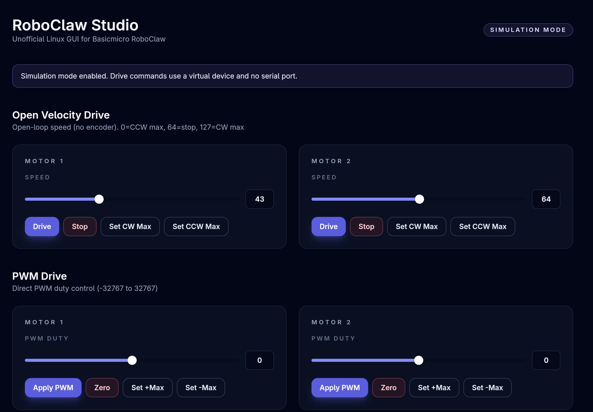

# RoboClaw Studio (Unofficial)

Linux GUI for **Basicmicro RoboClaw motor drivers**. This is an **unofficial** community-built app with a workflow inspired by the Windows-only Motion Studio. It is not affiliated with Basicmicro.




## Features

#### Main

- Drive M1/M2 with speed and PWM input
- Stop, max CW, max CCW controls
- Configure baud rate and serial port
- List available serial ports
- Read encoder speed, motor current, and PWM values
- Reset encoders

#### Experimental / Work in Progress

- Device Simulation
- Step and frequency response simulation/analysis
- CSV output
- Manual/Automated PID tuning
- ROS2 integration

## Install

### Arch Linux (AUR)

Package name: `roboclaw-studio-git` (VCS).

```bash
yay -S roboclaw-studio-git
# or
paru -S roboclaw-studio-git
```

If your installation fails, then try with `--rebuild`.

```bash
yay -S --rebuild
# or
paru -S --rebuild
```

Launch:

```bash
roboclaw-studio
```


### Ubuntu / Debian (Release .deb)

#### Note

This version is stable, but not maintained as often as AUR package.

Download the latest `.deb` from GitHub Releases and install:

```bash
sudo apt install ./roboclaw-studio_*.deb
```

### Manual Build (from source)

If you prefer to build from source:

1. Clone the repository:

```bash
git clone https://github.com/lazytatzv/motion_studio.git
cd motion_studio
```

2. Install dependencies:

```bash
pnpm install
```

3. Build the app:

```bash
pnpm build
pnpm tauri build
```

The Debian package is generated under `src-tauri/target/release/bundle/deb/`.

### Ubuntu / Debian (APT repo)

#### CAUTION!!

This feature is experimental. I recommend installing this app with .deb if you use Debian-based Linux.

1) Install the repo key:

```bash
curl -fsSL https://lazytatzv.github.io/motion_studio/roboclaw-studio.gpg | \
	sudo gpg --dearmor -o /usr/share/keyrings/roboclaw-studio.gpg
```

2) Add the repo source:

```bash
echo "deb [signed-by=/usr/share/keyrings/roboclaw-studio.gpg] https://lazytatzv.github.io/motion_studio stable main" | \
	sudo tee /etc/apt/sources.list.d/roboclaw-studio.list
```

3) Install:

```bash
sudo apt update
sudo apt install roboclaw-studio
```


## Usage

1) Connect RoboClaw via USB.
2) Set the serial port (e.g. `/dev/ttyACM0`) and baud rate.
3) Drive M1/M2 and monitor encoder/current/PWM values.

Default serial device can be overridden with:

```bash
ROBOCLAW_PORT=/dev/ttyACM1 roboclaw-studio
```

However, `roboclaw-studio` can dynamically detect serial ports, so you don't need to specify the environment variable.

If ports aren't detected, please confirm the permissions are valid. You can write udev rules or just run `chmod` to make them accessible.

## Development

### Prerequisites

- Node.js (LTS)
- pnpm
- Rust (stable)
- Linux dependencies for Tauri:
	- `libwebkit2gtk-4.1-dev`
	- `libgtk-3-dev`
	- `libayatana-appindicator3-dev`
	- `librsvg2-dev`
	- `libudev-dev`
	- `patchelf`

### Run in dev mode

```bash
pnpm install
pnpm tauri dev
```

### Build release

```bash
pnpm install
pnpm build
pnpm tauri build
```

The Debian bundle is generated under:

`src-tauri/target/release/bundle/deb/`

## Packaging

- AUR: [packaging/aur](packaging/aur)
- APT: [packaging/apt](packaging/apt)

## Contributing

See [CONTRIBUTING.md](CONTRIBUTING.md).

## Language note

I'm not a native English speaker. Simple English is appreciated, and Japanese is also OK.

## Author

Tatsuki Yano

## License

MIT
